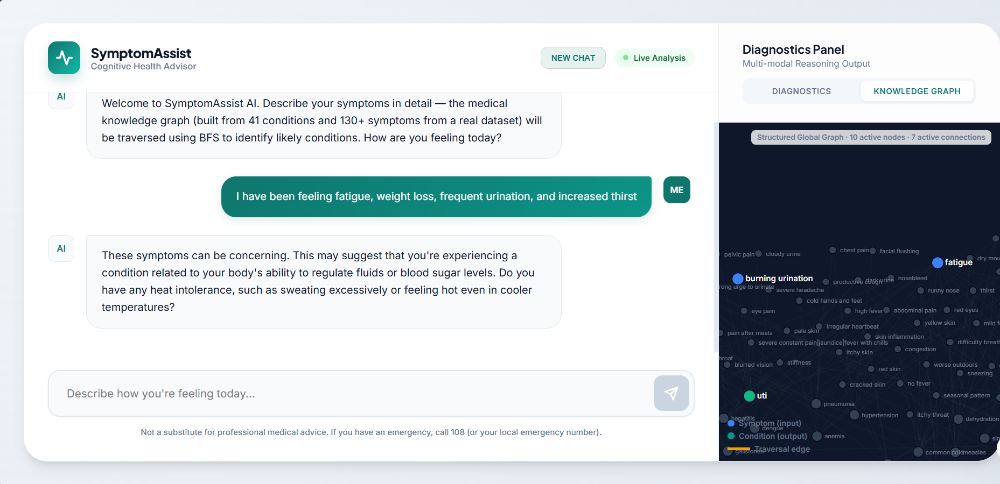
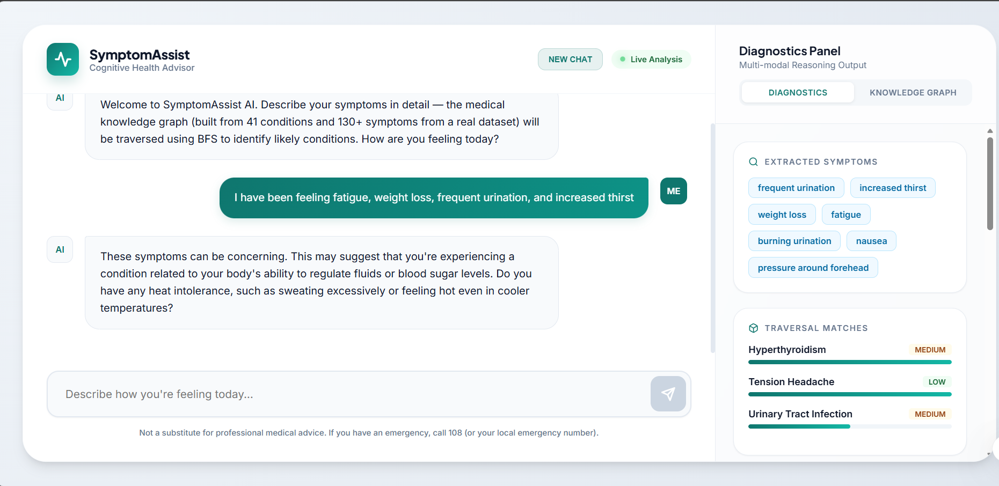

Part of **Nexus Spring of Code 2026 (NSOC '26)** — an open-source initiative empowering developers to build impactful, real-world projects.

---
# **🩺 SymptomAssist AI**

**A hybrid medical advisor that thinks in two layers — structured medical knowledge and conversational reasoning — so it can tell you what's wrong, not just what might be wrong.**

Most symptom checkers are either too vague ("you might have a cold or cancer") or too rigid (decision trees that break the moment your symptoms don't fit neatly into one box). SymptomAssist combines a symbolic knowledge graph with a language model — the graph keeps the reasoning grounded, the LLM keeps it human.

---

##   What It Looks Like

The interface has two panels working in parallel. On the left, a conversational chat. On the right, a live diagnostics view showing exactly what the system is doing — extracted symptoms, knowledge graph traversal, and ranked condition matches.

### **Chat + Knowledge Graph View**



The knowledge graph activates in real time as you describe your symptoms. Nodes light up as the BFS traversal finds connections across 41 conditions and 130+ symptoms.

### **Diagnostics Panel — Traversal Matches**



The diagnostics tab shows extracted symptoms as tags, then surfaces ranked condition matches (with confidence levels) based purely on graph traversal — before the LLM even generates a response.

---

## 🧠 How It Works

When you describe your symptoms, SymptomAssist doesn't just hand them to an LLM and hope for the best. It runs a structured two-stage pipeline:

```

Your input (natural language)

        │

        ▼

[ NLP Extractor ]       →  Pulls structured symptom terms from free text

        │

        ▼

[ Knowledge Graph ]     →  BFS traversal across 41 conditions, 130+ symptoms

        │                  Ranks matches by symptom overlap

        ▼

[ RAG Pipeline ]        →  Retrieves relevant medical documentation

        │                  Injects it into the LLM prompt as grounded context

        ▼

[ LLM (Groq) ]          →  Generates a cited, empathetic, conversational response

        │

        ▼

Diagnosis + Red Flag Alerts (if critical symptoms detected)

```

This separation matters. The knowledge graph catches things the LLM might hallucinate. The LLM handles things the knowledge graph can't express — nuance, follow-up questions, conversational tone.

---

##  🚀 Key Features

### **Neuro-symbolic Reasoning**

Medical facts live in the knowledge graph, not inside the LLM's weights. The model can't surface a condition unless the graph finds it first. This makes the system auditable, not just fluent.

### **Priority Red Flag Detection**

Critical symptoms are flagged before the full pipeline runs. You don't wait for a complete diagnosis to know something is urgent.

### **Logic-Grounded RAG**

Retrieved medical documents are injected directly into the LLM prompt. The model reasons over real sources, not just its training data.

### **Real-time Diagnostics Dashboard**

The right panel shows what's happening at each stage — extracted symptom tags, traversal matches with confidence scores, and the knowledge graph lighting up live as you type.

---

## ⚙️ Why This Architecture

Pure LLM symptom checkers have a well-documented problem: they're fluent, but not always accurate. They can generate convincing-sounding diagnoses that have no grounding in medical literature — and do it confidently.

The knowledge graph acts as a hard constraint. If a disease isn't connected to your symptoms in the graph, the system won't surface it. The RAG layer adds a second constraint — the LLM must reason over retrieved medical documentation, not just its parametric memory.

The result is a system that's harder to fool and easier to audit. You can see exactly why it reached a conclusion.

---

## 📂 Project Structure

```

cl_symptom/
├── app/
│   ├── core/
│   │   ├── knowledge_graph.py   # Symbolic reasoning (NetworkX + BFS traversal)
│   │   ├── nlp_extractor.py     # Symptom extraction (lexicon-based NLP)
│   │   └── rag_pipeline.py      # Medical RAG (semantic retrieval + context injection)
│   └── main.py                  # FastAPI entry point (orchestration layer)
│
├── data/
│   ├── symptom_disease.csv      # Structured symptom-condition mappings
│   └── medical_docs.csv         # Medical documents for RAG grounding
│
├── static/
│   └── index.html               # Frontend UI (Glassmorphism + D3.js graph)
│
├── assets/                      # Screenshots for documentation (README visuals)
│   ├── knowledge-graph.png
│   └── diagnostics-panel.png
│
├── .env.example                 # Environment variables template
├── requirements.txt             # Project dependencies
├── CONTRIBUTING.md              # Contribution guidelines
└── README.md                    # Project documentation

```

---

## 🚀 Getting Started

### Prerequisites

- Python 3.10+
- A [Groq API key](https://console.groq.com) (free tier works fine)

### Install

```bash

git clone https://github.com/your-username/SymptomAssist-AI.git
cd SymptomAssist-AI
pip install -r requirements.txt

```

### Configure

Copy the example env file and add your keys:

```bash

cp .env.example .env
```

```env

GROQ_API_KEY=your_groq_api_key_here

GEMINI_API_KEY=your_gemini_key_here   # optional

```

> Never commit your `.env` file. It's already in `.gitignore`.

### Run

```bash

uvicorn app.main:app --reload --port 8000

```

Open [http://localhost:8000](http://localhost:8000) in your browser.

---

## 🤝 Contributing

Contributions are welcome. See [CONTRIBUTING.md](CONTRIBUTING.md) for guidelines.

If you're fixing a bug or adding a feature, open an issue first so we can align on approach before you build it. For documentation improvements, feel free to raise a PR directly.

---

## ⚠️ Disclaimer

SymptomAssist is a research and educational tool. It is not a substitute for professional medical advice, diagnosis, or treatment. If you are experiencing a medical emergency, call 108 or your local emergency number immediately.
